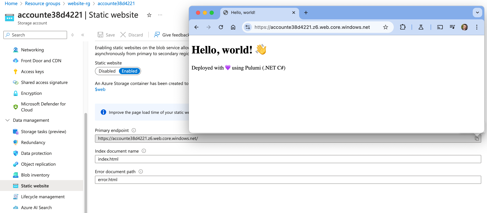

## Static Azure Web App with Pulumi

This is a simple example of how to deploy a static website to Azure Web App using Pulumi.

--- 

Pulumi is a powerful Infrastructure as Code (IaC) tool that allows developers to define cloud infrastructure using programming languages like Python, TypeScript, Go, and C#. However, like any tool, it has its limitations and challenges. Here are some known issues with Pulumi:

### **1. State Management Challenges**

- **State Locking Issues**: Pulumi does not provide native state locking like Terraform (which uses a state file lock in S3/DynamoDB). This can lead to race conditions when multiple users try to modify infrastructure simultaneously.
- **State Corruption Risks**: Since Pulumi maintains state in its backend (local, S3, Azure, GCS, or Pulumi Cloud), there’s a risk of state corruption if not properly managed.
- **Limited State Manipulation**: Unlike Terraform, Pulumi does not provide easy ways to manually edit state, making it difficult to recover from certain failures.

### **2. Learning Curve and Debugging**

- **Complex Debugging**: Errors in Pulumi scripts can be harder to diagnose, especially when debugging runtime errors related to dependencies or cloud provider issues.
- **Developer Experience Variability**: Since Pulumi relies on general-purpose languages, developers might face issues with dependency conflicts, version mismatches, or unintended side effects in infrastructure code.

### **3. Limited Provider Support and Maturity**

- **Less Mature Than Terraform**: Terraform has broader adoption and a richer ecosystem of community-maintained modules, while Pulumi's provider ecosystem is still growing.
- **Provider API Inconsistencies**: Some cloud providers' APIs (e.g., AWS, Azure, GCP) may have missing features or behave inconsistently across different versions.

### **4. Performance and Execution Issues**

- **Slow Performance for Large Projects**: Pulumi can be slower compared to Terraform when managing large-scale infrastructure due to runtime execution in a full-fledged programming language.
- **Serialization Overhead**: Pulumi must serialize and deserialize cloud resources in its state, which can add latency.

### **5. Vendor Lock-in and Cloud Dependencies**

- **Tied to Pulumi Cloud (Optional but Encouraged)**: While Pulumi allows using self-managed backends, it heavily encourages using Pulumi Cloud for state management, which may not align with enterprise security policies.
- **Cross-Cloud Complexity**: While Pulumi supports multi-cloud configurations, managing dependencies between different cloud providers can become complex and error-prone.

### **6. Infrastructure Drift and Reconciliation Issues**

- **Drift Detection Is Not Fully Automated**: Pulumi does not provide native drift detection like Terraform's `terraform plan`, making it harder to detect and reconcile changes made outside of Pulumi.
- **Inconsistent `destroy` Behavior**: The `pulumi destroy` command can sometimes fail to remove all resources due to dependencies or missing references in the state.

### **7. Cost and Licensing Concerns**

- **Pricing for Pulumi Cloud**: Pulumi Cloud offers collaboration features, but the pricing can be a concern for small teams or startups.
- **Enterprise Features Behind Paywall**: Some advanced features, such as access control and policy enforcement, require a paid Pulumi Cloud subscription.

