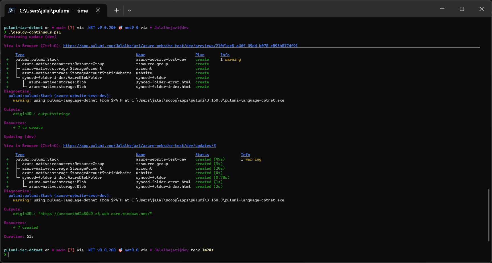
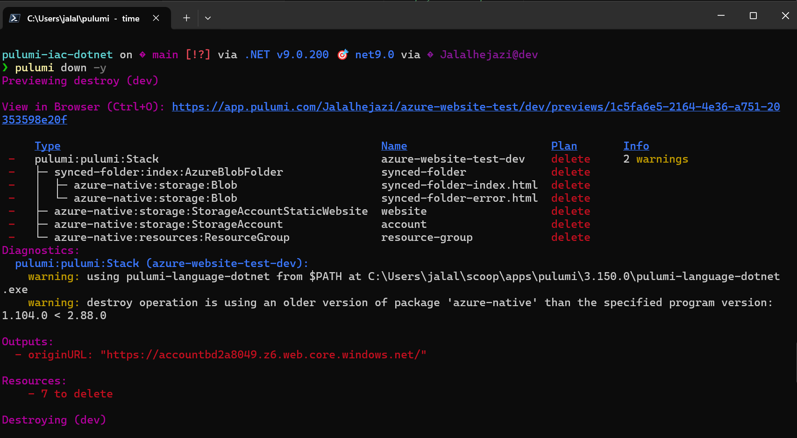

## Deploying IaC as static Azure Web App with Pulumi


### Pulumi up | Big bang deployment & Rolling update

```powershell
## This script is used to deploy the infrastructure to azure using Pulumi
.\deploy-continuous.ps1
```




### Verify Cloud desired state


### Cleanup to free up cost and capacity 



--- 

### [Pulumi IaC trade-off analysis](./tradeoff.md)